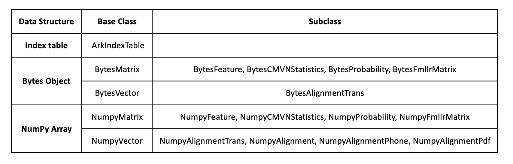
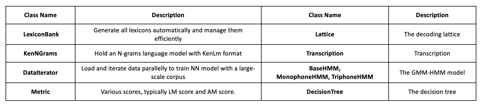

# Exkaldi: An advance kaldi wrapper for Python 
[](https://github.com/wangyu09/Exkaldi/blob/master/LICENSE)

================================

Exkaldi automatic speech recognition toolkit is designed to build an interface between [Kaldi ASR toolkit](https://github.com/kaldi-asr/kaldi) and Python. 
Differing from other kaldi wrappers, Exkaldi have these features:  
1. Integrated APIs to build a ASR systems, including training HMM-GMM acoustic model, training HMM-DNN acoustic model, training and quering a N-grams language model, decoding and scoring.  
2. Exkaldi C++ library was designed to support, such as ctc decoding for End-to-End.   
3. Use KenLm as languange model backend.

The goal of Exkaldi is to help developers build high-performance ASR systems with Python language easily.

## The Concept of Exkaldi
We use three data structures to discribe the Kaldi numerical data archieves: __Index Table__, __Bytes Object__ and __NumPy Array__. They all stand for the same data.  

  
  
__Index Table__: hold the index information of archieve which has been saved in files.  
__Bytes Object__: hold the data in memory with bytes format.   
__NumPy Array__: hold the data in memory with NumPy array format.

These three structures have been designed as various specified classes in Exkaldi. Basesd on these classes, Exkaldi interacts with Kaldi command-line API to process archieves and build ASR system via Python subprocess.  
Basically, these three data structures have these features:  
1. They can convert to one another easily.  
2. They are treated by Exkaldi functions without distinction.  
3. Achieves with Bytes format is the main currency in single process, but achieves with index table format are more used for mutiple processes.  
4. Achieves with NumPy format can be used to generate iterable dataset and train NN model with deep learning frameworks, such as Tensorflow.  

In the follow table, there is a glance of Exkaldi numerical data archieve class group:  

  

Beside above, Exkaldi has complete approaches to carry and process other archieves and objects.  
In the follow table, there is a glance of other main data classes in Exkaldi:  

  

With the help of these classes, Exkaldi is qualified to build a complete ASR system from the scratch to a state-of-the-art level.

## Parallel Processes In Exkaldi
Starting from version 1.3, we support mutiple processes so as to deal with a large-scale corpus. When process a small one, such as TIMIT coupus in our examples, we prefer to apply the single process that will hold on data in memory, and defaultly appoint buffer as IO streams during the processing. For example, we want to compute the MFCC feature from a script-table file:
```
# Single process
wavFile = "wav.scp"
feat = Exkaldi.compute_mfcc(wavFile, rate=16000, name="dummy_mfcc")
```
The returned object: ___feat___ would be an Exkaldi __BytesFeature__ object.
Implementing parallel processes is easy in Exkaldi because you only need to give the function mutiple resources. Exkaldi will decide a parallel strategy and assign these recources automatically. For example:
```
# Parallel processes
wavFiles = ["wav_0.scp", "wav_1.scp"]
feat = Exkaldi.compute_mfcc(wavFiles, rate=16000, name="dummy_mfcc", outFile="dummy_mfcc.ark")
```
This function will run double processes parallelly because it received two scripts. At the moment, the IO streams must be files and the currency will become index table. In above case, the returned object: ___feat___ would be two Exkaldi __ArkIndexTable__ objects.  
In particular, we not only accept mutiple recources but also different parameters. This is different with Kaldi. Just for example, we will use different sample rates to compute the MFCC feature:
```
# Parallel processes
wavFile = "wav.scp"
rates = [16000, 8000]
feat = Exkaldi.compute_mfcc(wavFile, rate=rates, name="dummy_mfcc", outFile="dummy_mfcc.ark")
```
We think it will be very useful on some ocassions, such as decoding.

## Installation

(We only tested our toolkit on Ubuntu >= 16.)

1. If you have not installed Kaldi ASR toolkit, clone the Kaldi ASR toolkit repository firstly (Kaldi version 5.5 is expected.)
```
git clone https://github.com/kaldi-asr/kaldi.git kaldi --origin upstream
```
And follow these three tutorial files to install and compile it.
```
less kaldi/INSTALL
less kaldi/tools/INSTALL
less kaldi/src/INSTALL
```

2. You can install Exkaldi toolkit from PyPi library. (Out of use temporarily)
```
pip install Exkaldi (Out of use temporarily)
```
But we recommand you can clone the Exkaldi source code from our github project, then install it.
```
git clone https://github.com/wangyu09/Exkaldi.git
cd Exkaldi
bash quick_install.sh
```

3. Check if it is installed correctly.
```
python -c "import Exkaldi"
```


## Tutorial

In [Exkaldi/tutorials](tutorials) directory, we prepared a simple tutorial to show how to use Exkaldi APIs to build a ASR system from the scratch.
The data is from librispeech train_100_clean dataset. This tutorial includes:
1. Extract and process feature.  
2. Train and querying a N-grams language model.  
3. Train monophone GMM-HMM, build decision tree, triphone GMM-HMM.  
4. Train a DNN acoustic model with tensorflow.  
5. Compile WFST decoding graph.  
6. Decode based on GMM-HMM and DNN-HMM.  
7. Process lattice and compute score WER.  

This ASR symtem built here is just a dummy model, and we have done some formal experiments in [Exkaldi/examples](examples). Check the source code to look more information about Exkaldi APIs.

## Experiments

We have done some experiments to test Exkaldi toolkit, and it achived a good performance.
(We will upload the results of experiments little by little.)

#### TIMIT

1, The perplexity of various language models. All these systems are trained with TIMIT train data and tested with TIMIT test data. The score showed in the table is weighted average of all utterances and weights are the sentence length of each utterance.  

|                           | __2-grams__  | __3-grams__ | __4-grams__ |
| :-----------------------: | :----------: | :---------: | :---------: |
| __kaldi baseline irstlm__ | 14.67        | ---         | ---         |
| __Exkaldi srilm__         | 14.69        | 13.44       | 14.26       |
| __Exkaldi kenlm__         | 14.64        | __13.07__   | 13.20       |

2, The word error rate(WER) of various systems. All these systems are trained with TIMIT train dataset and tested with TIMIT test dataset. The Language model backend used in Exkaldi is Kenlm. From the results, we can know than KenLm is avaliable to optimize the language model. And what's more, with Exkaldi, we cherry-picked the N-grams by testing the perplexity and it improved the performance of ASR system.

|                           | __mono__  | __tri1__ | __tri2__ | __tri3__ |
| :-----------------------: | :-------: | :------: | :------: | :------: |
| __kaldi baseline 2grams__ | 32.54     | 26.17    | 23.63    | 21.54    |
| __Exkaldi 2grams__        | 32.53     | 25.89    | 23.63    | 21.43    |
| __Exkaldi 3grams__        | 31.42     | 24.57    | 22.13    |__20.83__ |